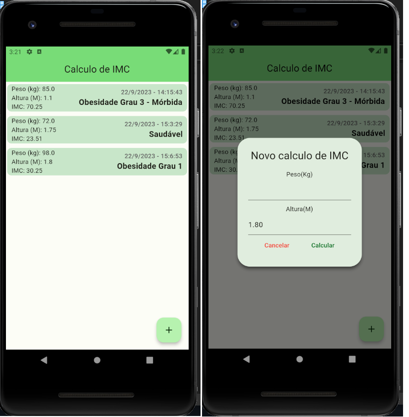

# imc_flutter_with_data_persistence
Projeto proposto no Bootcamp de Flutter do Santander Becas + DIO

Esse projeto consistiu em aprimorar a calculadora de IMC que já haviamos feito anteriomente. Foi adicionada a persistência de dados para o campo de altura, usando o shared_preferences e também para o histórico de consultas utilizando o Hive.

##### Quer testar?
Instale o apk do caminho abaixo no seu telefone ou emulador:
  
 - build/app/outputs/flutter-apk/app-release.apk
  

